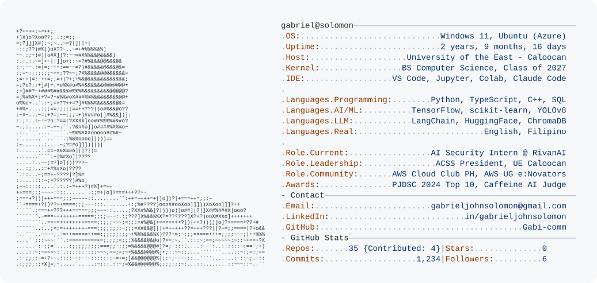

  <picture>
    <source media="(prefers-color-scheme: dark)" srcset="dark_mode.svg">
    
  </picture>
<picture>
  <source media="(prefers-color-scheme: dark)" srcset="pacman_dark.svg">
  
</picture>

<picture>
  <source media="(prefers-color-scheme: dark)" srcset="activity_dark.svg">
  
</picture>
